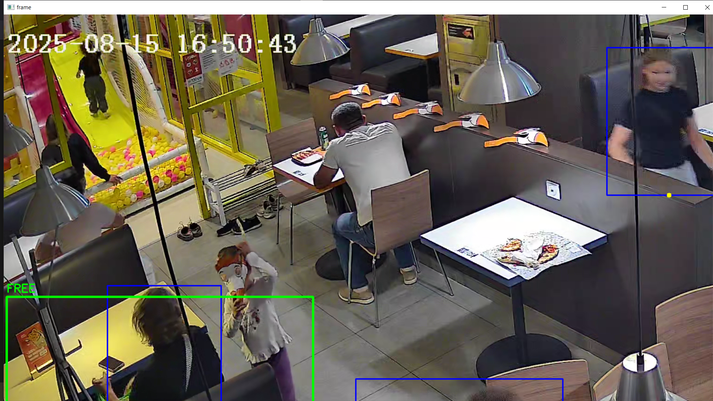

# Прототип системы детекции уборки столиков по видео

##  Запуск проекта

```bash
pip install -r requirements.txt
python main.py --video video1.mp4
```

---

##  Используемое видео

В работе использовано Видео 1.

Для анализа выбиран крайний левый столик, который задаётся вручную пользователем с помощью инструмента cv2.selectROI при запуске программы.

---

##  Логика решения

### 1. Детекция людей
Используется готовая модель **YOLOv8n (Ultralytics)** для обнаружения людей на каждом кадре видео.

---

### 2. Определение зоны столика (ROI)

Пользователь вручную выделяет область столика на первом кадре видео с помощью `cv2.selectROI`.

Далее система проверяет, попадает ли человек в эту область.

---

### 3. Определение состояния столика

Состояние определяется с использованием time-based логики:

* если человек обнаружен в зоне — стол считается занятым
* если человек пропал, но прошло менее 2 секунд — стол всё ещё считается занятым
* если человек отсутствует более 2 секунд — стол считается свободным

---

### 4. Фиксация событий

Регистрируются события:

* `approach` — появление человека в зоне после пустоты
* `empty` — стол стал свободным

Для уменьшения ложных срабатываний используется задержка между событиями (debounce).
---

##  Аналитика

Все события записываются в **Pandas DataFrame** и сохраняются в файл `events_log.csv`.

Для каждого случая перехода:

```text
empty → approach
```
рассчитывается время ожидания следующего посетителя.

### Результат:

Среднее время:

```text
Avg delay: 10.29 sec
```
проблемный кадр:

---

##  Визуализация

На выходном видео (`output.mp4`) отображается:

* bounding box выбранного столика
* цвет состояния:

  * зелёный — стол свободен
  * красный — стол занят
  * детекции людей

---


##  Результаты работы

* `output.mp4` — видео с визуализацией
* `events_log.csv` — таблица событий
